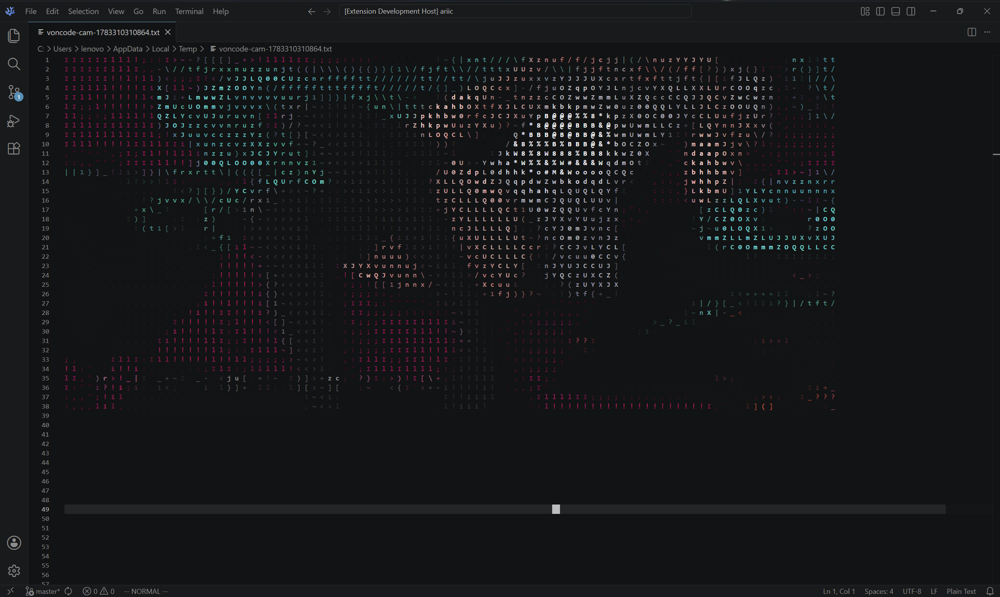

# voncode — Play Video as ASCII Art in VS Code / VS Codium

Play any video file as colored ASCII art directly in your editor.



## Prerequisites

- [ffmpeg](https://ffmpeg.org/) and ffprobe must be installed and available on PATH.

## Installation

```bash
git clone 
cd voncode
pnpm install
pnpm run compile
```

Then press F5 to launch Extension Development Host, or package as `.vsix`:

```bash
pnpm install -g @vscode/vsce
vsce package
```

Install the resulting `.vsix` via `Extensions: Install from VSIX...` in the command palette.

## Usage

1. Open any file (used as viewport reference).
2. `Ctrl+Shift+P` → **Play Video as ASCII Art**
3. Select a video file (`mp4`, `mkv`, `webm`, `avi`, `mov`, etc.).
4. Watch colored characters dance in your editor at 5(?) fps
5. `Ctrl+Shift+P` → **Stop Video Playback** to stop.

## How It Works

1. ffprobe probes the video dimensions.
2. A temporary text file is created as a "canvas", sized to your editor's visible area.
3. ffmpeg decodes the video into raw RGB frames.
4. Each pixel is mapped to a character (by brightness) and colored (by hue) using VS Code's `TextEditorDecorationType`.

```
Pixel RGB → brightness -> char
Pixel RGB → hue        -> color
```

## Building

```bash
pnpm run compile      # check types + lint + bundle
pnpm run watch        # watch mode for development
```

## License

MIT
